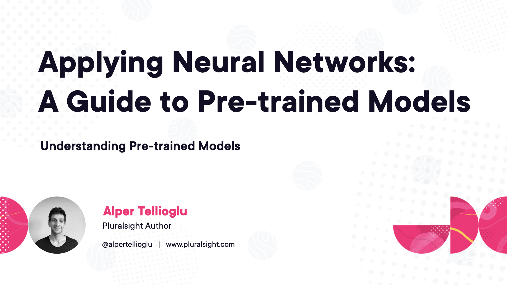

Repository for Pluralsight course "Applying Neural Networks: A Guide to Pre-trained Models"

Find and download course materials and notebooks. You can use issues tab if you have any questions.

[Kaggle Notebook](https://www.kaggle.com/code/alpertellioglu/dogs-cats-fine-tuning-vgg16)

[VGG Architecture 3D Demo](https://my.spline.design/vggarchitecturecopy-52b372074ca8b4b760136769716a9bf7/)

